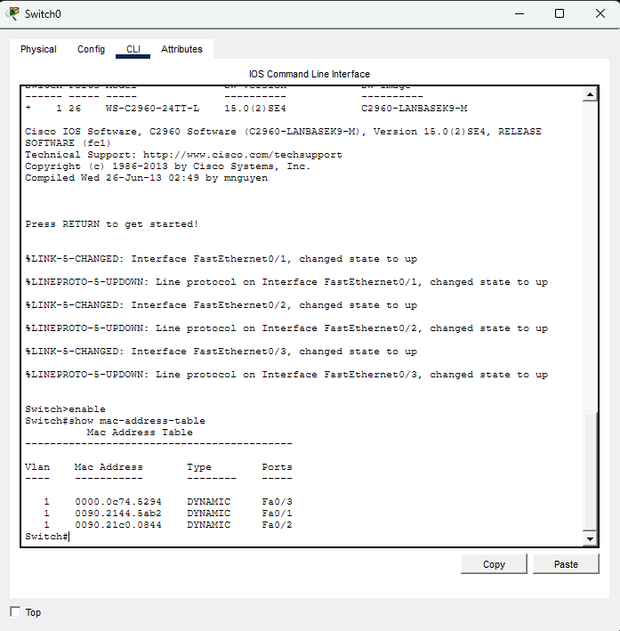

# Laboratorio 01: Mi Primera Red (Bases de Networking para Ciberseguridad)

Este es mi primer laboratorio práctico para construir las bases sólidas de redes indispensables en el área de la Ciberseguridad. Diseñé una topología LAN básica en Cisco Packet Tracer con dos hosts y un Switch 2960.

Asigné direccionamiento IPv4 estático (`192.168.1.0/24`) y validé la conectividad local mediante ICMP (`ping`). Este ejercicio es el pilar fundamental para entender el tráfico de red antes de avanzar hacia el análisis de paquetes (Wireshark), escaneo de puertos (Nmap) y reglas de Firewall.

### 📊 Evidencia de Conectividad (Prueba de Ping)

---

## 🛡️ Laboratorio 02: Hub vs. Switch (Análisis de Sniffing en Capa 2)

### 🎯 Objetivo:
Demostrar de forma práctica por qué los Hubs representan un riesgo crítico de seguridad (*Eavesdropping / Sniffing*) debido a su naturaleza de medio compartido, y cómo un Switch mitiga esto mediante la microsegmentación y el uso de su tabla CAM.

### 🔬 Resultados del Experimento:
1. **Lado del Hub (Inseguro):** Al activar el modo simulación y enviar un paquete ICMP (`ping`) desde la PC Administradora al Servidor, el Hub duplicó y transmitió el paquete de forma masiva a todos sus puertos, haciendo que la PC Atacante recibiera una copia exacta del tráfico.
2. **Lado del Switch (Seguro):** El Switch procesó las tramas leyendo las direcciones MAC de origen y destino. Tras el proceso inicial de ARP, el tráfico fluyó de manera exclusiva entre el emisor y el receptor.

### 🔍 Evidencia Técnica (Tabla MAC Dinámica del Switch)
Utilizando el comando `show mac-address-table` en la interfaz de línea de comandos (CLI) del Switch, se verificó cómo este mapea dinámicamente las direcciones MAC físicas a sus puertos correspondientes para tomar decisiones de reenvío unicast, aislando al atacante del canal de comunicación:

