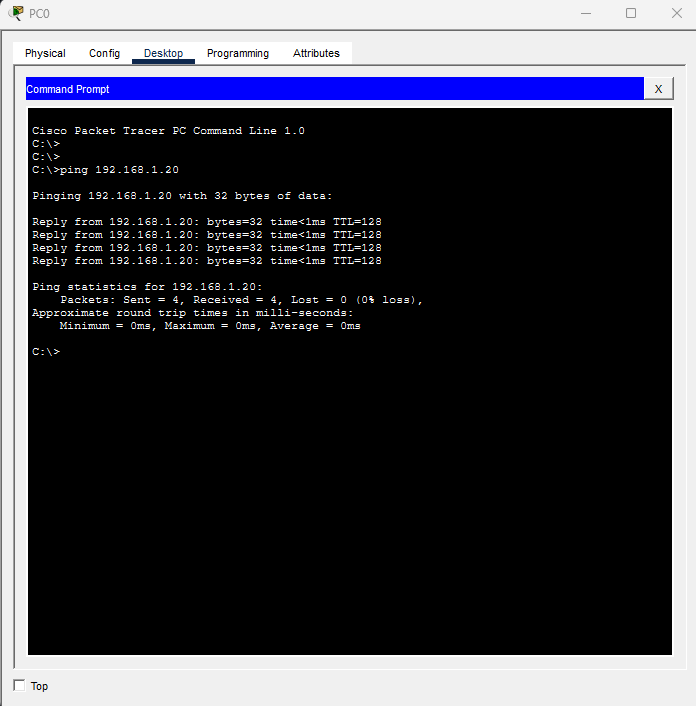

# Laboratorio 01: Mi Primera Red (Bases de Networking para Ciberseguridad)

Este es mi primer laboratorio práctico para construir las bases sólidas de redes indispensables en el área de la Ciberseguridad. Diseñé una topología LAN básica en Cisco Packet Tracer con dos hosts y un Switch 2960.

Asigné direccionamiento IPv4 estático (`192.168.1.0/24`) y validé la conectividad local mediante ICMP (`ping`). Este ejercicio es el pilar fundamental para entender el tráfico de red antes de avanzar hacia el análisis de paquetes (Wireshark), escaneo de puertos (Nmap) y reglas de Firewall.

### 📊 Evidencia de Conectividad (Prueba de Ping)

